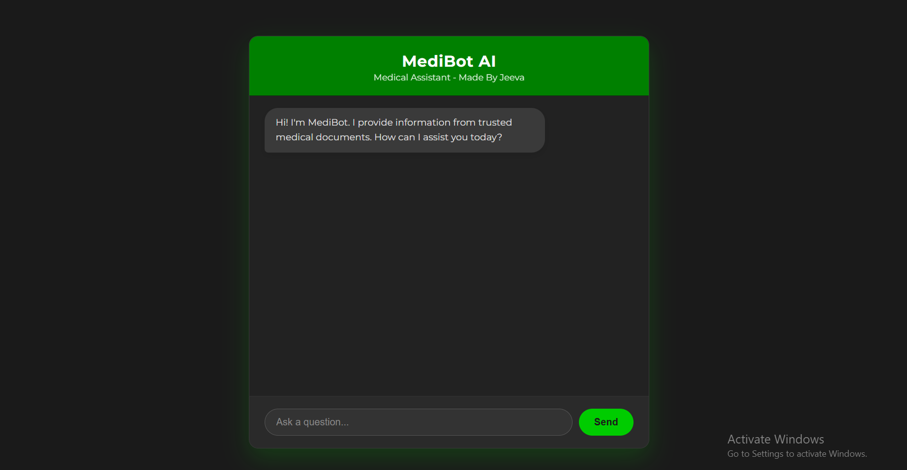

# MediBot: A Private AI Medical Chatbot 

MediBot is a 100% private and secure medical chatbot. It uses a locally-hosted Llama 2 model to answer questions **only** based on a set of trusted medical documents.

This project uses **Retrieval-Augmented Generation (RAG)** to prevent the AI from "hallucinating" or providing dangerous, non-factual medical advice. The AI is forced to find the answer in your documents and then summarize it.

## Demo





##  Key Features

* **100% Local LLM:** Your questions are processed on your own computer by Llama 2. Nothing is sent to an external API (like OpenAI or Google).
* **RAG Pipeline:** Ensures all answers are based *only* on the trusted medical PDFs you provide, building in safety and accuracy.
* **Professional Vector DB:** Uses **Pinecone** as a cloud-based, scalable vector store for managing the knowledge base.
* **Source-Backed Answers:** The chatbot shows you exactly which documents it used to find the answer, building user trust.
* **Professional UI:** A custom-built, responsive dark-mode UI with a "popping" hover effect, built with Flask, HTML, CSS, and JavaScript.

## Architecture

The application is a hybrid model, combining the best of local privacy and cloud scalability.

1.  **Frontend (HTML/CSS/JS):** A user-friendly web interface that sends user questions to the backend.
2.  **Backend (Flask):** A Python server that:
    * Receives the question.
    * Queries the **Pinecone** vector database to find relevant facts.
    * Injects those facts into a prompt for the **Local Llama 2** model.
    * Returns the final, sourced answer to the frontend.


##  Tech Stack

* **Backend:** Python, Flask
* **LLM:** Llama 2 (running locally via `CTransformers`)
* **Vector DB:** Pinecone
* **Embeddings:** `Sentence-Transformers` (all-MiniLM-L6-v2)
* **Document Loading:** `LangChain`, `PyPDFLoader`
* **Frontend:** HTML, CSS, JavaScript

##  Getting Started

Follow these steps to set up and run the project on your local machine.

### 1. Prerequisites

* Python 3.9 or newer.
* A **Llama 2 GGUF model file**. This project runs the LLM locally and **requires you to download the model file** (approx. 4GB).
* A free **Pinecone** account.

### 2. Installation

1.  **Clone the repository:**
    ```bash
    git clone [https://github.com/YOUR_USERNAME/YOUR_REPOSITORY_NAME.git](https://github.com/YOUR_USERNAME/YOUR_REPOSITORY_NAME.git)
    cd YOUR_REPOSITORY_NAME
    ```

2.  **Create and activate a virtual environment:**
    ```bash
    # Create the venv
    python -m venv venv

    # Activate on Windows
    .\venv\Scripts\activate
    ```

3.  **Install all required packages:**
    ```bash
    pip install -r requirements.txt
    ```

### 3. Configuration

1.  **Download the Llama 2 Model:**
    * You must download a Llama 2 GGUF model file.
    * A compatible model can be downloaded here:
        **[Llama-2-7B-Chat-GGUF (Q4_K_M)](https://huggingface.co/TheBloke/Llama-2-7B-Chat-GGUF/blob/main/llama-2-7b-chat.Q4_K_M.gguf)**
    * Save this `.gguf` file to a permanent location on your computer (e.g., `C:\Users\YourUser\models\`).

2.  **Set up Pinecone:**
    * Log in to your [Pinecone](https://www.pinecone.io/) account.
    * Create a new **Index**.
    * Give it an `Index name` (e.g., `medical-bot`).
    * **Crucial:** Set the **Dimensions** to `384` (to match our embedding model).
    * Set the **Metric** to `cosine`.

3.  **Set up Environment File:**
    * Create a file named `.env` in the project root.
    * Go to "API Keys" in Pinecone and copy your key.
    * Add your key to the `.env` file:
        ```
        PINECONE_API_KEY=YOUR_SECRET_API_KEY_HERE
        ```

4.  **Update Config Files:**
    * **`ingest.py`:** Change the `INDEX_NAME` variable to match your Pinecone index name.
    * **`app.py`:**
        * Change the `INDEX_NAME` variable to match your Pinecone index name.
        * **Crucial:** Change the `MODEL_PATH` variable to the full, absolute path of your downloaded Llama 2 `.gguf` file from Step 1.

        ```python
        # Example of what to change in app.py:
        MODEL_PATH = r"C:\Users\YourUser\models\llama-2-7b-chat.Q4_K_M.gguf"
        ```

##  Step-by-Step Execution

### Step 1: Ingest Your Data (One-Time Setup)

This script "teaches" the bot by reading your documents and uploading them to Pinecone.

1.  Place all your medical `.pdf` files into the `/data` folder.
2.  Run the ingestion script from your terminal:
    ```bash
    python ingest.py
    ```
3.  Wait for the script to finish. You will see a "Successfully uploaded" message.

### Step 2: Run the Chatbot

1.  Run the main Flask application:
    ```bash
    python app.py
    ```
2.  Wait for the LLM to load. You will see a message like:
    `* Running on http://127.0.0.1:5000`
3.  Open that URL (`http://127.0.0.1:5000`) in your web browser.
4.  You can now start asking questions!
